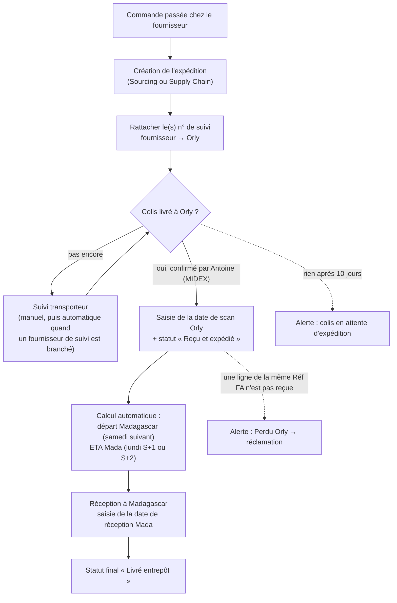

# 📦 Shipment Manager — Supply Chain Control Tower

Application interne de suivi des imports (aérien et maritime) vers Madagascar.
Elle remplace progressivement le fichier Excel **RECEP_IMPORT** : réceptions
fournisseurs à Orly, départs vers Madagascar, conteneurs maritimes, alertes et
relances.

> Ce document décrit **l'application telle qu'elle est dans le code** (branche
> `main`). Les évolutions prévues sont listées à part, dans la section
> [Feuille de route](#12-feuille-de-route).

---

## Sommaire

1. [Architecture](#1-architecture)
2. [Rôles et droits](#2-rôles-et-droits)
3. [Écrans](#3-écrans)
4. [Flux de travail d'une expédition](#4-flux-de-travail-dune-expédition)
5. [Statuts : qui les change et quand](#5-statuts--qui-les-change-et-quand)
6. [Alertes](#6-alertes)
7. [Suivi transporteur](#7-suivi-transporteur)
8. [Ce qui est automatique et ce qui est manuel](#8-ce-qui-est-automatique-et-ce-qui-est-manuel)
9. [Points d'attention connus](#9-points-dattention-connus)
10. [Données, API et sécurité](#10-données-api-et-sécurité)
11. [Installation, configuration et déploiement](#11-installation-configuration-et-déploiement)
12. [Feuille de route](#12-feuille-de-route)
13. [Historique des évolutions](#13-historique-des-évolutions)

---

## 1. Architecture

```text
Navigateur (React 19 + Vite + TypeScript + Tailwind)
        │  fetch(..., credentials: 'include')  — cookie de session HttpOnly
        ▼
API Express (src/serverApp.ts)
  • en local : server.ts (port 3000)
  • en production : Vercel Serverless (api/index.ts)
        │
        ├── Neon PostgreSQL ........ source de vérité de toutes les données métier
        ├── Gemini (@google/genai) .. assistant IA, appelé uniquement côté serveur
        ├── Google Chat ............ relances par webhook (URL fixée côté serveur)
        └── Vercel Cron ............ rafraîchissement quotidien du suivi transporteur
```

Principes :

- **Neon est la seule source de vérité.** Le navigateur n'enregistre rien
  d'autre que le thème clair/sombre (`localStorage.shipment_manager_theme`).
- **Aucun secret côté navigateur.** Aucune variable `VITE_*` sensible ; Gemini,
  Neon et Google Chat ne sont appelés que par le serveur.
- **Aucune donnée inventée.** Pas de suivi simulé, pas de valeur métier
  pré-remplie ; une information inconnue reste vide.

---

## 2. Rôles et droits

Trois rôles. Le serveur fait foi : masquer un bouton ne remplace jamais le
contrôle côté API.

| Action | SUPPLY_CHAIN | SOURCING | DIRECTION |
|---|:---:|:---:|:---:|
| Consulter le tableau de bord, utiliser l'assistant IA | ✅ | ✅ | ✅ |
| Voir les listes Aérien / Maritime | ✅ | ✅ | ❌ (voir §9) |
| Créer / modifier une expédition | ✅ | ✅ | ❌ |
| Supprimer une expédition | ✅ | ❌ | ❌ |
| Ajouter un transporteur / fournisseur à la liste | ✅ | ✅ | ❌ |
| Numéros de suivi et événements (ajout, correction) | ✅ | ✅ | ❌ |
| Voir et résoudre / réactiver les alertes | ✅ | ✅ | ❌ |
| Envoyer une relance Google Chat | ✅ | ✅ | ❌ |
| Synchroniser le suivi d'une expédition | ✅ | ✅ | ❌ |
| Synchroniser tout le suivi | ✅ | ❌ | ❌ |
| Analyses & SLAs | ✅ | ❌ | ❌ |
| Utilisateurs, administration base, purge | ✅ | ❌ | ❌ |

Protections sur les comptes :

- on ne peut ni se désactiver soi-même, ni retirer son propre rôle SUPPLY_CHAIN ;
- le **dernier compte SUPPLY_CHAIN actif** ne peut être ni rétrogradé ni désactivé ;
- un compte désactivé perd immédiatement ses sessions.

---

## 3. Écrans

| Menu | Rôles | Contenu |
|---|---|---|
| Tableau de bord | tous | Indicateurs, alertes critiques, dernières expéditions mises à jour, actions rapides |
| Suivi Aérien | SC, Sourcing | Liste des expéditions `Air`, filtres, **édition directe** du statut, de la date de scan Orly, de la Réf FA, de la réception Mada et des remarques ; export CSV ; « Générer réclamation » (colis Perdu Orly) |
| Suivi Maritime | SC, Sourcing | Liste des expéditions `Sea` et, pour chacune, le tableau des livraisons au quai de Rouen |
| Centre d'Alertes | SC, Sourcing | Alertes calculées, message de relance pré-rédigé, envoi Google Chat, résolution partagée |
| Analyses & SLAs | SC | Respect des SLAs par transporteur, top fournisseurs, délai moyen de transit |
| Assistant IA | tous | Questions sur les expéditions, synthèse automatique (limité à 40 requêtes par heure et par utilisateur) |
| Administration & N8N | SC | État de la base, initialisation du schéma, purge, test Google Chat |
| Script Démo & Livrables | SC | Contenu de démonstration hérité du prototype (voir §9) |
| Paramètres | SC | Gestion des utilisateurs |

**Fiche expédition** (clic sur une ligne) : informations générales, dates
calculées (départ Madagascar, ETA Mada), pilotage opérationnel (statuts,
remarques), **Suivi transporteur** (numéros et historique), livraisons
maritimes, historique de l'expédition, documents.

---

## 4. Flux de travail d'une expédition

### 4.1 Vue d'ensemble



### 4.2 Qui fait quoi, étape par étape

| # | Étape | Qui | Où dans l'application | Manuel / auto |
|---|---|---|---|---|
| 1 | Créer l'expédition : mode, transporteur, fournisseur, réf. commande/PO, n° de suivi, réf. FA DIGI-NXT, statuts de départ, ETA, poids, coût | Sourcing (à la commande) ou Supply Chain | Bouton « Nouvelle expédition » | **Manuel** |
| 2 | Ajouter un transporteur ou un fournisseur absent de la liste | Sourcing / Supply Chain | Dans le formulaire : « + Ajouter… » | **Manuel** |
| 3 | Rattacher les numéros de suivi | Automatique à la création (champ n° de suivi), puis ajout manuel si besoin | Fiche → Suivi transporteur | **Auto** à la création, **manuel** ensuite |
| 4 | Suivre la livraison jusqu'à Orly | Supply Chain | Fiche → Suivi transporteur | **Manuel** pour l'instant (ajout d'événements) ; **auto** dès qu'un fournisseur de suivi est branché (§7) |
| 5 | Point hebdomadaire avec Antoine (MIDEX, Orly) : ce qui est reçu, ce qui manque | Supply Chain | Liste Aérien + fiche | **Manuel** — Antoine n'a pas de compte ; ses confirmations sont saisies par Supply Chain |
| 6 | Saisir la date de scan Orly et passer le statut à « Reçu et expédié » | Supply Chain | Liste Aérien (édition directe) ou fiche | **Manuel** |
| 7 | Départ Madagascar et ETA Mada | — | Affichés dans la liste et la fiche | **Auto**, calculés depuis la date de scan Orly |
| 8 | Traiter les alertes : relancer, puis marquer « Résolu » | Supply Chain / Sourcing | Centre d'Alertes | Alertes **auto** ; relance et résolution **manuelles** |
| 9 | Réception à Madagascar : date de réception, statut « Livré entrepôt » | Supply Chain | Liste Aérien ou fiche | **Manuel** |
| 10 | Maritime : saisie des livraisons au quai de Rouen (article, volume, statut, réception Rouen) | Supply Chain | Suivi Maritime → fiche | **Manuel** |
| 11 | Consulter les indicateurs | Direction, tous | Tableau de bord | Calcul **auto** |

---

## 5. Statuts : qui les change et quand

Une expédition porte plusieurs statuts, chacun avec son rôle.

| Champ | Valeurs | Quand / par qui | Manuel / auto |
|---|---|---|---|
| **Statut global** (statut Orly → Mada) | Attente confirmation transitaire · En livraison vers Orly · Reçu et expédié · Bloqué douane · Perdu Orly · Livré entrepôt | Choisi à la création, puis modifié au fil de l'eau par Supply Chain (liste ou fiche) | **Manuel**, sauf « Perdu Orly » qui peut être **déduit automatiquement** (voir §6 et §9) |
| **Statut Antoine** | En attente Antoine · Confirmé · Transmis transitaire · A vérifier | Après chaque point avec Antoine | **Manuel** (fiche) |
| **Statut douane** | Non Requis · En cours · Dédouané · Bloqué Douane | Choisi à la création | **Manuel**, et seulement à la création aujourd'hui (§9) |
| **Priorité** | Haute · Moyenne · Basse | Choisie à la création | **Manuel**, seulement à la création (§9) |
| **Date de scan Orly** | date | Quand Antoine confirme la réception | **Manuel** |
| Statut Orly (« Scanné & Expédié Orly ») | — | Dès qu'une date de scan Orly est saisie | **Auto** |
| **Départ Madagascar** | date ou « Non parti » | Samedi qui suit le scan Orly | **Auto** |
| **ETA Mada (semaine du)** | date ou « Non parti » | Scan lundi–jeudi → lundi suivant ; scan vendredi–dimanche → lundi de la 2ᵉ semaine | **Auto** |
| **Date de réception Mada** | date | À l'arrivée à Madagascar | **Manuel** |
| **Statut de chaque n° de suivi** | Aucune information · Informations reçues · En transit · En cours de livraison · Livré · Incident | Toujours celui de l'événement le plus récent | **Auto** à partir des événements ; les événements sont saisis à la main ou reçus d'un transporteur |
| **Alerte résolue** | oui / non | Après traitement de la relance | **Manuel**, partagé entre tous les utilisateurs |
| Livraisons maritimes (réception Rouen) | Oui · Non · A confirmer svp | À chaque livraison au quai | **Manuel** |

---

## 6. Alertes

Les alertes sont **recalculées automatiquement** à chaque chargement, à partir
des données (`src/lib/rulesEngine.ts`). Personne ne les crée à la main. Leur
**résolution** est manuelle et **partagée** : une alerte résolue par une
personne apparaît résolue pour tout le monde, au rechargement de la page ou à
l'ouverture du Centre d'Alertes.

| Règle | Déclenchement | Gravité |
|---|---|---|
| Perdu Orly | Statut global = Perdu Orly. Le statut est aussi **déduit** quand d'autres lignes de la même Réf FA DIGI-NXT sont reçues et pas celle-ci. | Critique |
| Colis en attente d'expédition | 10 jours ou plus depuis la dernière date connue (statut transporteur, sinon dernière mise à jour, sinon création) sans statut « Reçu et expédié » | Critique |
| Blocage douane | Statut douane = Bloqué Douane, ou statut global = Bloqué douane | Critique |
| ETA dépassée | ETA passée sans statut transporteur « Delivered » | Avertissement |

Chaque alerte propose un **message de relance** prêt à copier ou à envoyer sur
Google Chat. Les résolutions et réactivations sont tracées dans le journal
d'audit.

---

## 7. Suivi transporteur

Pour chaque expédition, la fiche contient un panneau **Suivi transporteur** :

- **plusieurs numéros par expédition**, stockés en texte (plus de chiffres
  perdus comme dans Excel) ;
- **détection automatique du transporteur** d'après le format du numéro
  (Amazon `FR…`, UPS `1Z…`, Colissimo `6A…`, Chronopost `X…FR`, etc.),
  toujours corrigeable à la main ; un format ambigu reste « Non identifié » ;
- **signalements** : référence de bon de livraison fournisseur (« BL … »)
  saisie à la place d'un numéro de suivi, numéro tronqué par Excel ;
- **historique d'événements** par numéro, avec leur source (saisie manuelle,
  API transporteur, rapport Amazon…) et l'auteur de la saisie ;
- le **statut du numéro** suit toujours l'événement le plus récent.

**Automatisation.** L'application sait interroger des « fournisseurs de
suivi » (un par transporteur), mais **aucun n'est encore branché** : tout le
suivi est donc manuel pour l'instant. Branchements prévus, tous gratuits :
rapport d'expéditions Amazon Business, API La Poste (Colissimo et Chronopost),
UPS, DHL et FedEx. Une fois un fournisseur branché :

- un **cron quotidien** (limite du plan Vercel Hobby : une fois par jour) met
  à jour les numéros actifs non livrés ;
- le bouton **Synchroniser** apparaît dans la fiche ;
- en cas d'échec du transporteur, **l'ancien suivi est conservé** et l'erreur
  est affichée. Rien n'est jamais simulé.

---

## 8. Ce qui est automatique et ce qui est manuel

**Automatique aujourd'hui**

- Calcul du départ Madagascar et de l'ETA Mada à partir de la date de scan Orly.
- Passage du statut Orly à « Scanné & Expédié Orly » quand une date de scan est saisie.
- Calcul des alertes et des indicateurs du tableau de bord.
- Déduction « Perdu Orly » pour les lignes non reçues d'une Réf FA déjà reçue.
- Rattachement des numéros de suivi saisis à la création, avec détection du transporteur.
- Statut d'un numéro de suivi recalculé à chaque nouvel événement.
- Journal d'audit de toutes les actions sensibles.

**Manuel aujourd'hui**

- Création et modification des expéditions, statut global, statut Antoine.
- Dates de scan Orly et de réception Madagascar.
- Événements de suivi transporteur, jusqu'au branchement des API gratuites.
- Livraisons maritimes (quai de Rouen) et suivi des conteneurs.
- Relances Google Chat et résolution des alertes.

**Pas encore disponible**

- Synchronisation Google Sheets (bouton retiré : elle n'existait qu'en simulation).
- Stockage réel des documents (les documents ne sont que des métadonnées).
- Intégrations Odoo / DIGI, Amazon Business, MIDEX.

---

## 9. Points d'attention connus

Écarts entre le fonctionnement actuel et le fonctionnement attendu. Ils
touchent au moteur de règles ou aux droits, et ne seront corrigés qu'après
validation.

1. **Le suivi transporteur n'alimente pas encore les alertes.** Les règles
   « ETA dépassée » et « Colis en attente » lisent l'ancien champ unique de
   statut transporteur, qui n'est plus rempli. Une ETA dépassée reste donc en
   alerte même si le colis est marqué « Livré » dans le panneau de suivi.
2. **« Perdu Orly » déduit peut être enregistré.** La déduction se fait à
   l'affichage, mais si la fiche est enregistrée ensuite, ce statut est
   sauvegardé dans la base.
3. **L'alerte « colis en attente » (10 jours) vise large.** Elle se déclenche
   aussi pour des expéditions « Livré entrepôt » et pour le maritime, dès que
   la fiche n'a pas été modifiée depuis 10 jours.
4. **Statut douane et priorité** ne sont modifiables qu'à la création.
5. **« Livré Orly »** est proposé à la création mais absent des listes de
   modification.
6. **Direction** ne voit que le tableau de bord et l'assistant, alors que la
   matrice des droits prévoit la consultation des expéditions et des analyses.
7. **« Script Démo & Livrables »** contient du contenu de démonstration avec
   des chiffres fictifs : à retirer.
8. Les **statuts Antoine** de l'application ne correspondent pas encore à ceux
   du fichier Excel (« A recevoir », « OK (Reçu et expédié) », « Déjà reçu
   Mada, à refacturer (REGUL) », « Avis de recherche »).

---

## 10. Données, API et sécurité

### Tables Neon

| Table | Contenu |
|---|---|
| `shipments` | Expéditions. `carrier` et `supplier` restent en texte (compatibilité historique). |
| `shipment_carriers`, `shipment_suppliers` | Listes de référence (unicité sans tenir compte de la casse ; transporteur avec mode Air / Sea / les deux) |
| `shipment_tracking_numbers`, `shipment_tracking_events` | Numéros de suivi et historique d'événements |
| `resolved_alerts` | Alertes résolues (état partagé) |
| `users`, `user_sessions` | Comptes et sessions (jeton haché en SHA-256) |
| `system_audit_logs` | Journal d'audit (l'auteur est dans `details`) |
| `api_rate_limits` | Compteurs de limitation (connexion, IA) |
| `app_migrations` | Migrations de données ponctuelles déjà appliquées |

Les tables sont créées automatiquement au premier usage (`CREATE TABLE IF NOT
EXISTS`) ; aucune migration manuelle n'est nécessaire. `src/db/schema.sql`
documente le schéma.

### API principales

| Méthode et route | Rôle requis |
|---|---|
| `POST /api/auth/login`, `GET /api/auth/me`, `POST /api/auth/logout` | public / session |
| `GET /api/health` | public |
| `GET /api/shipments`, `GET /api/shipments/:id` | connecté |
| `POST /api/shipments`, `PUT /api/shipments/:id` | SC, Sourcing |
| `DELETE /api/shipments/:id`, `POST /api/shipments/clear-all` | SC |
| `GET` / `POST /api/reference/carriers`, `/api/reference/suppliers` | lecture : connecté ; création : SC, Sourcing |
| `GET /api/shipments/:id/tracking` | connecté |
| `POST /api/shipments/:id/tracking-numbers`, `PATCH` / `DELETE /api/tracking-numbers/:id`, `POST /api/tracking-numbers/:id/events` | SC, Sourcing |
| `POST /api/tracking/sync/:shipmentId` | SC, Sourcing |
| `POST /api/tracking/sync-all` | SC |
| `GET /api/cron/update-tracking` | Vercel Cron (`Authorization: Bearer CRON_SECRET`) |
| `GET /api/alerts/resolved`, `POST` / `DELETE /api/alerts/:alertId/resolve` | lecture : connecté ; action : SC, Sourcing |
| `POST /api/google-chat-webhook` | SC, Sourcing |
| `POST /api/chat`, `POST /api/analyze-shipments` | connecté (40 requêtes par heure) |
| `/api/admin/users…`, `/api/db/status`, `/api/db/init` | SC |

### Sécurité

- Mots de passe hachés avec bcrypt ; session en cookie HttpOnly, `Secure` en
  production, valable 7 jours.
- Limitation des connexions : 30 tentatives par IP et 8 échecs par email, par
  tranche de 15 minutes.
- Les réponses d'erreur ne contiennent jamais de détail technique ; le détail
  reste dans les logs Vercel.
- Le webhook Google Chat part uniquement vers l'URL configurée côté serveur.
- Le cron refuse de s'exécuter sans `CRON_SECRET`.
- Journal d'audit : connexions, utilisateurs, expéditions, suivi, alertes,
  références, purge.

---

## 11. Installation, configuration et déploiement

### Prérequis

Node.js 20+ et une base Neon PostgreSQL.

### Variables d'environnement

| Variable | Usage |
|---|---|
| `DATABASE_URL` (ou `POSTGRES_URL`) | Connexion Neon |
| `GEMINI_API_KEY` | Assistant IA |
| `GOOGLE_CHAT_WEBHOOK_URL` | Relances Google Chat |
| `CRON_SECRET` | Obligatoire pour le cron quotidien de suivi |
| `NODE_ENV` | `production` en production (cookie `Secure`) |

Ne jamais exposer ces valeurs via une variable `VITE_*`. Le fichier `.env` est
ignoré par Git ; `.env.example` ne contient que les noms.

### Développement local

```bash
npm install
cp .env.example .env      # puis renseigner les valeurs
npm run dev               # http://localhost:3000 (API + interface)
npm run lint              # vérification TypeScript
npm run build             # build de production
```

Premier compte administrateur (SUPPLY_CHAIN), une fois la base créée :

```bash
ADMIN_EMAIL=... ADMIN_PASSWORD='12 caractères minimum' npx tsx scripts/create-admin.ts
```

### Déploiement

- GitHub → Vercel. Les routes `/api/*` sont servies par `api/index.ts`.
- Cron déclaré dans `vercel.json` : `/api/cron/update-tracking`, une fois par
  jour (plan Hobby : l'heure exacte peut varier de ±59 minutes).

### Façon de travailler sur le code

- Une branche par sujet, une Pull Request relue, puis fusion dans `main`.
  Jamais de `push --force`.
- Vérifier la prévisualisation Vercel de la Pull Request avant de fusionner.
- Ne pas modifier le code en parallèle dans Google AI Studio.

---

## 12. Feuille de route

1. Corriger les points d'attention du §9, avec validation des règles métier.
2. Aligner les statuts sur le fonctionnement réel (Antoine, statut Orly → Mada).
3. Écran « Attendus de la semaine » pour le point hebdomadaire avec Antoine.
4. Suivi automatique gratuit : rapport Amazon Business, La Poste, UPS, DHL, FedEx.
5. Import de l'historique du fichier RECEP_IMPORT.
6. Deux niveaux : réceptions fournisseur regroupées en expédition MIDEX
   (vol groupé ORYA) ou en conteneur.
7. Module Incidents (colis à retracer), historique des ETA maritimes, coûts par
   envoi groupé.
8. Stockage réel des documents ; intégrations Odoo / DIGI et MIDEX.

---

## 13. Historique des évolutions

| Phase | Contenu |
|---|---|
| 1 | Suppression des données de suivi simulées et de la fausse synchronisation Google Sheets ; webhook Google Chat limité à l'URL serveur ; routes base de données réservées à SUPPLY_CHAIN ; bouton Supprimer réservé à SUPPLY_CHAIN |
| 2 | Listes transporteurs et fournisseurs dans Neon avec ajout direct ; formulaire de création sans exemples ni valeurs pré-remplies ; statut Antoine, priorité et statut douane obligatoires ; une création ne peut plus écraser une expédition existante |
| 3 | Alertes résolues partagées dans Neon ; protections sur la gestion des utilisateurs ; journal d'audit complet |
| 4 | Plus aucun détail technique dans les réponses d'erreur ; limitation des connexions et de l'IA ; onglet Alertes ouvert à SOURCING |
| 5 | Base du suivi transporteur : plusieurs numéros par expédition, historique d'événements, détection du transporteur, cron quotidien sécurisé |
